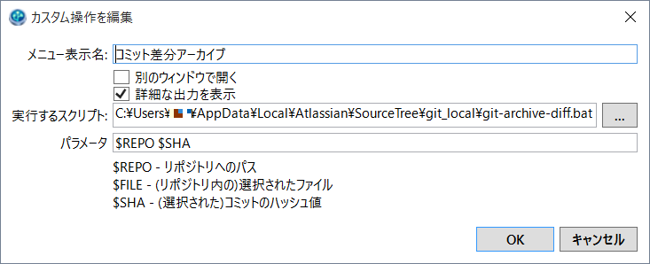

# SourceTree 差分アーカイブ作成バッチ
----

### 登録手順

#### １・下記フォルダにバッチファイルをコピー

```
%appdata%\..\Local\Atlassian\SourceTree\git_local

- git-archive-diff.bat
- git-archive-diff.sh
```

#### ２・SourceTreeのカスタム操作を登録



```
ツール＞オプション>カスタム操作＞追加
表示名：コミット差分アーカイブ
実行するスクリプト：%appdata%\..\Local\Atlassian\SourceTree\git_local\git-archive-diff.bat
パラメータ：$REPO $SHA
```

#### ３・ Gitコマンドで日本語を扱えるようにする

```
ターミナルを開き下記コマンドを実行

git config --global core.quotepath false
```

#### ４・実行

```
コミットIDを選択し右クリック＞カスタム操作＞コミット差分アーカイブ
正常終了するとデスクトップ上にZIPファイルが作成される

- コミットIDは1つだけ選択すると1つ前のコミットからの差分ファイルを抽出
- コミットIDを2つ選択すると2つのコミット間の差分ファイルを抽出
(範囲選択ではなく必ずCtrl+クリックで2つだけコミットIDを選択してください)

```
